# Inversion de Contrôle & Injection des Dépendances

## 1. L'interface IDao
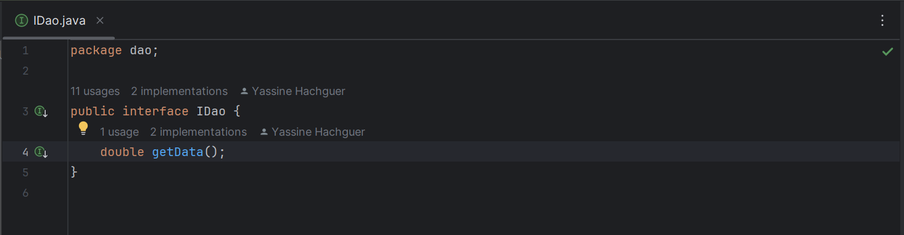

## 2. Implémentation de l'interface IDao
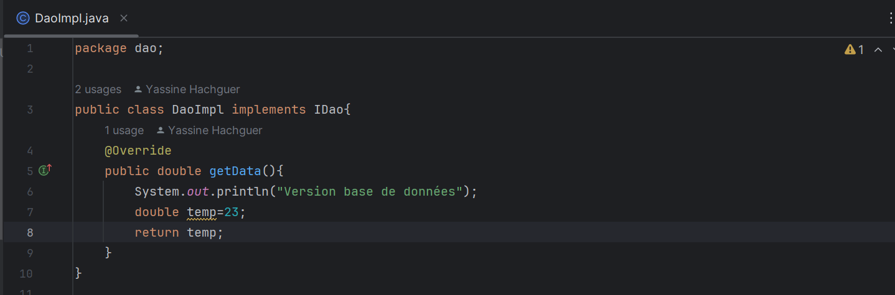

## 3. L'interface IMetier
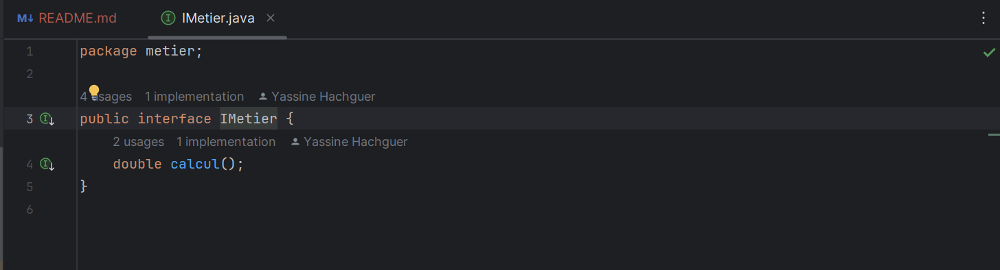

## 4. Implémentation de l'interface IMetier
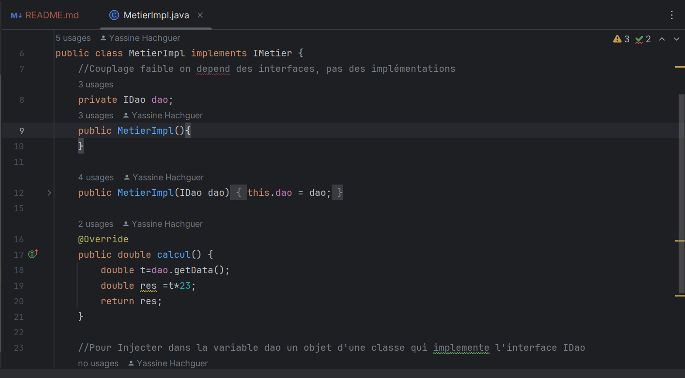

## 5. L'Injection des Dépendances

### a. Par instanciation statique
Dans cette approche, Injection des dépendances par instanciation Statique via le setter ou Constructeur
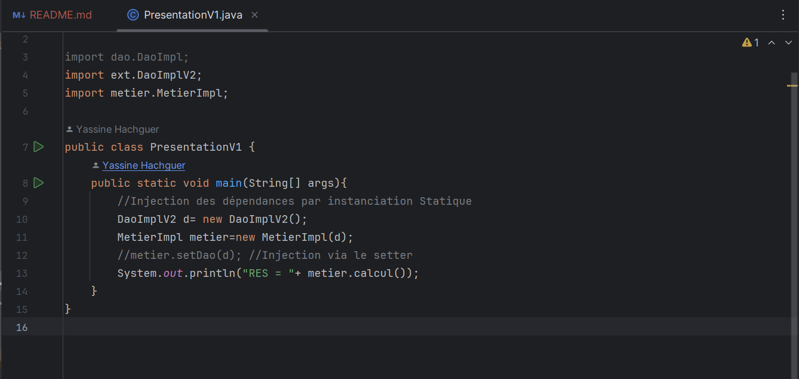

**Résultat :**
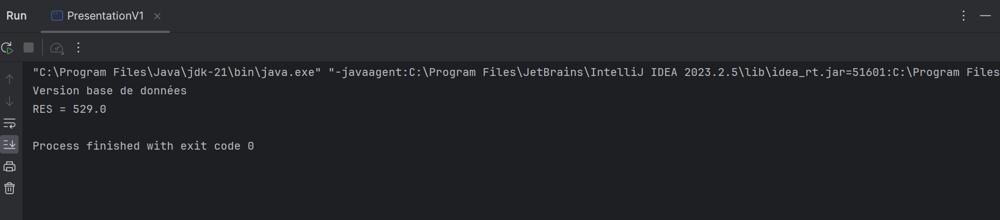

### b. Par instanciation dynamique
Dans cette approche, Injection des dépendances par instanciation Dynamique en utilisant un fichier de Configuration
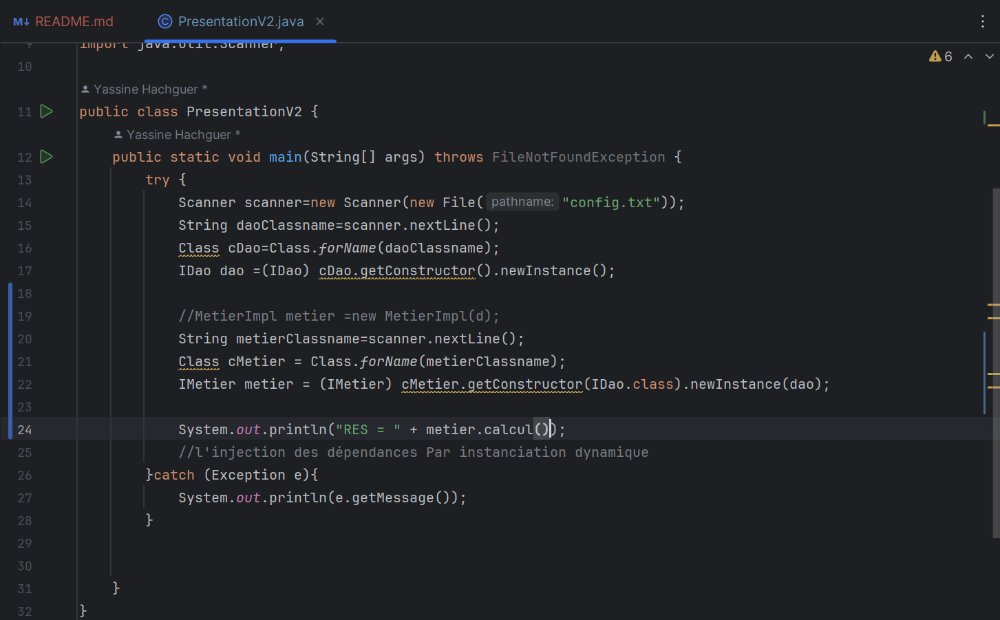

**Fichier de Configuration :**
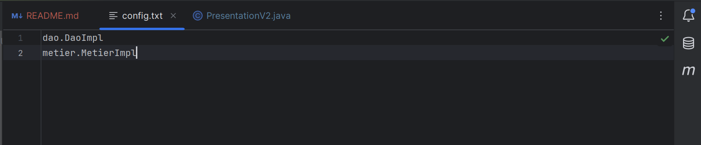

**Résultat :**
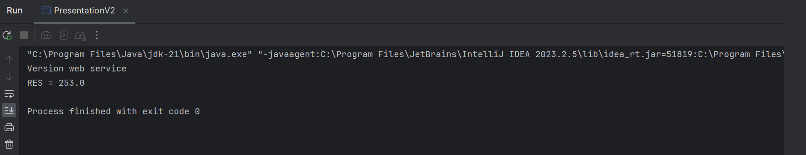

### c. En utilisant le Framework Spring
**Version XML :**
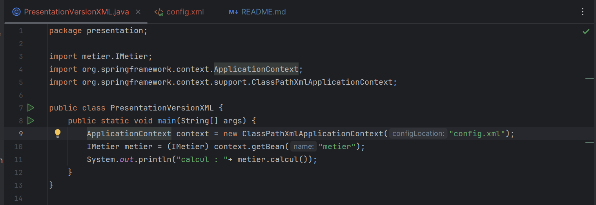

**Fichier de Config XML :**
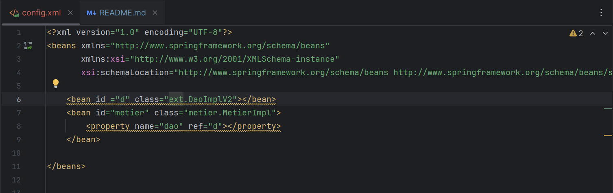

**Version Annotations :**
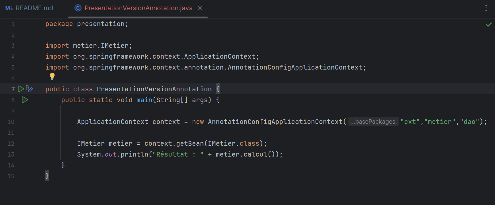

**Ajout des Annotations nécessaires :**
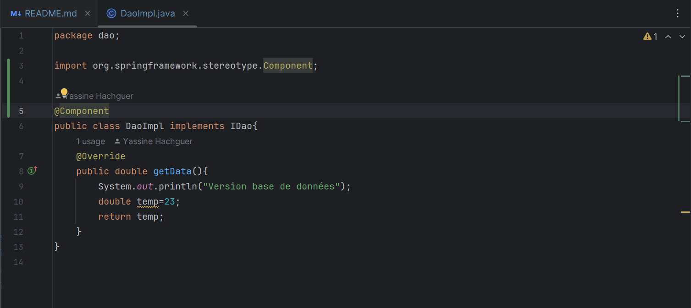
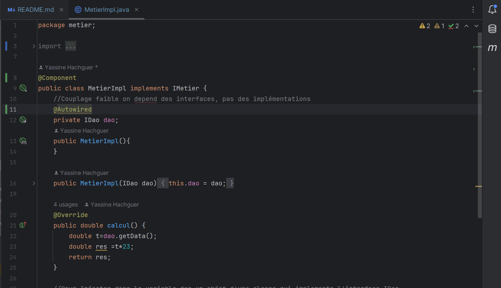